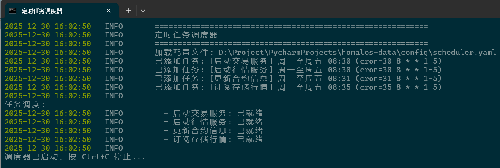

# Homalos Data

期货行情数据采集与存储系统，基于CTP接口实现实时行情订阅、Tick数据存储和K线合成。

## 功能特性

- 连接SimNow等CTP行情服务器
- 订阅全市场期货合约行情
- 实时存储Tick数据到CSV文件
- 实时合成多周期K线（1m, 3m, 5m, 10m, 15m, 30m, 60m, 日线）
- WebSocket服务端，支持多客户端连接
- 定时任务调度器，支持cron表达式

## 项目结构

```
homalos-data/
├── config/                 # 配置文件
│   ├── config_md.yaml      # 行情服务配置
│   ├── config_td.yaml      # 交易服务配置
│   └── scheduler.yaml      # 定时任务配置
├── data/                   # 数据存储目录
│   ├── instruments.json    # 合约信息缓存
│   ├── ticks/              # Tick数据 (按交易日/合约)
│   └── klines/             # K线数据 (按交易日/周期/合约)
├── scripts/                # 脚本工具
├── src/                    # 源代码
│   ├── apps/               # FastAPI应用
│   ├── gateway/            # CTP网关
│   ├── services/           # 服务层
│   ├── storage/            # 存储引擎
│   └── utils/              # 工具类
└── tests/                  # 测试代码
```

## 快速开始

### 1. 安装依赖

```bash
.venv\Scripts\activate
uv sync
```

### 2. 配置环境变量

创建 `.env` 文件：

```env
CTP_USER_ID=你的账号
CTP_PASSWORD=你的密码
```

### 3. 运行

#### 直接运行

```bash
# 启动交易服务
python main.py --config=./config/config_td.yaml --app_type=td

# 启动行情服务
python main.py --config=./config/config_md.yaml --app_type=md

# 更新合约信息(依赖于交易服务)
python scripts/update_instruments.py

# 订阅并存储行情数据(依赖于行情服务)
python scripts/store_market_data.py
```

或者

```bash
# 启动交易服务后启动更新合约信息
start_update_instruments.bat

# 启动行情服务后启动存储行情数据
start_store_market_data.bat
```

#### 定时运行

```bash
# 任务调度器按 config/scheduler.yaml 中的定时任务调度配置执行
start_scheduler.bat
```



## 数据存储格式

### Tick数据

存储路径: `data/ticks/{交易日}/{合约代码}.csv`

| 字段 | 说明 |
|------|------|
| Timestamp | ISO 8601时间戳 |
| TradingDay | 交易日 |
| InstrumentID | 合约代码 |
| LastPrice | 最新价 |
| Volume | 成交量 |
| Turnover | 成交额 |
| OpenInterest | 持仓量 |
| BidPrice1~5 | 买一~买五价 |
| BidVolume1~5 | 买一~买五量 |
| AskPrice1~5 | 卖一~卖五价 |
| AskVolume1~5 | 卖一~卖五量 |

### K线数据

存储路径: `data/klines/{交易日}/{周期}/{合约代码}.csv`

| 字段 | 说明 |
|------|------|
| Timestamp | ISO 8601时间戳 |
| Open | 开盘价 |
| High | 最高价 |
| Low | 最低价 |
| Close | 收盘价 |
| Volume | 成交量 |
| Turnover | 成交额 |
| OpenInterest | 持仓量 |

### 时间格式

所有时间字段统一使用 **ISO 8601** 国际标准格式（东八区）：

```
YYYY-MM-DDTHH:mm:ss.sss+08:00
```

示例：
- Tick时间: `2025-12-30T09:30:15.500+08:00`
- K线时间: `2025-12-30T09:30:00.000+08:00`

## 脚本说明

### store_market_data.py

订阅并存储期货合约的Tick数据和K线数据。

```bash
python scripts/store_market_data.py
```

### query_tick_csv.py

查询Tick数据。

```bash
# 查询Tick数据（显示最后10条）
python scripts/query_tick_csv.py query 20251230 FG605

# 查询更多条数
python scripts/query_tick_csv.py query 20251230 FG605 --limit 50

# 指定显示字段
python scripts/query_tick_csv.py query 20251230 FG605 --fields "Timestamp,LastPrice,Volume"

# 列出某交易日所有合约
python scripts/query_tick_csv.py list 20251230

# 列出所有交易日
python scripts/query_tick_csv.py days

# 显示CSV所有字段
python scripts/query_tick_csv.py fields 20251230 FG605
```

### query_kline_csv.py

查询K线数据。

```bash
# 查询K线数据（显示最后10条）
python scripts/query_kline_csv.py query 20251230 1m FG605

# 查询更多条数
python scripts/query_kline_csv.py query 20251230 1m FG605 --limit 50

# 列出某交易日某周期的所有合约
python scripts/query_kline_csv.py list 20251230 1m

# 列出所有交易日
python scripts/query_kline_csv.py days
```

周期参数：`1m`, `3m`, `5m`, `10m`, `15m`, `30m`, `60m`, `1d`

### scheduler.py

定时任务调度器。

```bash
# 启动调度器
python scripts/scheduler.py

# 列出所有任务
python scripts/scheduler.py --list

# 立即执行指定任务
python scripts/scheduler.py --run="启动交易服务"
```

配置文件 `config/scheduler.yaml`：

```yaml
tasks:
  - name: "启动交易服务"
    type: service
    config_file: "./config/config_td.yaml"
    app_type: td
    cron: "30 8 * * 1-5"  # 周一到周五 08:30
    enabled: true

  - name: "更新合约信息"
    type: command
    command: "python scripts/update_instruments.py"
    cron: "0 8 * * 1-5"
    enabled: false
```

cron 表达式格式：`分 时 日 月 周`

### update_instruments.py

更新合约信息到 `data/instruments.json`。

```bash
python scripts/update_instruments.py
```

## 批处理脚本

```bash
start_md_server.bat          # 启动行情服务
start_td_server.bat          # 启动交易服务
start_store_market_data.bat  # 启动行情存储
start_scheduler.bat          # 启动定时调度器
start_update_instruments.bat # 更新合约信息
```

## License

BSD 3-Clause License
